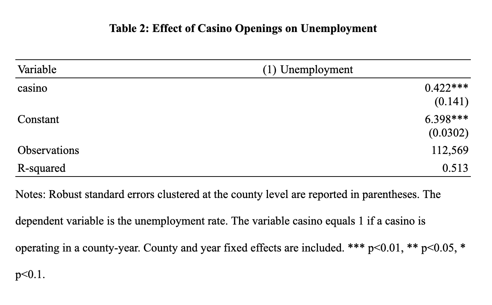

# Casino Openings and County Labor Markets: A Panel Data Analysis

## Overview

This project examines the relationship between casino openings and county unemployment in the United States using modern panel data econometric methods.

Completed as part of my Senior Seminar in Economics at Michigan State University, the project combines publicly available labor market and casino data to evaluate whether casino development improves local employment outcomes. The analysis emphasizes reproducible research, transparent data preparation, and evidence-based policy evaluation.

---

## Research Question

**Do casino openings improve local labor market outcomes by reducing county unemployment?**

---

## Dataset

- **112,569 county-year observations**
- **Time Period:** 1990–2024
- **Primary Source:** Bureau of Labor Statistics (Local Area Unemployment Statistics)
- Publicly available casino opening records
- County-level panel dataset

---

## Methodology

The analysis estimates the relationship between casino openings and county unemployment using:

- Two-Way Fixed Effects (TWFE) Panel Regression
- Ordinary Least Squares (OLS)
- County-clustered robust standard errors
- Panel data analysis
- Data cleaning and validation in Stata

---

# Summary Statistics

---

# Regression Results

---

## Key Findings

The Two-Way Fixed Effects model estimates a **positive and statistically significant** relationship between casino operation and county unemployment after controlling for county and year fixed effects.

The estimated coefficient suggests that counties with an operating casino experienced unemployment rates approximately **0.42 percentage points higher** than comparable counties without an operating casino.

These findings suggest that casino development alone should **not** be viewed as a guaranteed strategy for improving local labor market outcomes and that broader economic conditions continue to play an important role.

---

## Skills Demonstrated

- Applied Econometrics
- Panel Data Analysis
- Two-Way Fixed Effects (TWFE)
- Statistical Modeling
- Data Cleaning & Validation
- Stata Programming
- Research Design
- Policy Analysis
- Data Visualization
- Reproducible Research

---

## Repository Structure

| File | Purpose |
|------|---------|
| `master.do` | Executes the complete analysis workflow |
| `01_prepare_data.do` | Cleans unemployment data |
| `02_prepare_lookup.do` | Creates county and state lookup tables |
| `03_merge_data.do` | Merges datasets into a panel |
| `04_prepare_casino.do` | Constructs casino treatment variables |
| `05_build_analysis.do` | Builds the final analysis dataset |
| `06_analysis.do` | Estimates econometric models and produces tables |

---

## Software

- Stata
- Microsoft Excel

---

## Replication

This repository contains the complete Stata workflow used in the analysis.

Some raw datasets are publicly available but are **not redistributed** in this repository due to licensing and data source requirements. The analysis can be replicated by obtaining the original datasets from:

- Bureau of Labor Statistics (LAUS)
- Public casino opening records

---

## Research Paper

The complete paper is available in this repository:

**📄 Casino_Openings_and_County_Labor_Markets.pdf**

---

## Author

**Faisal Mulla**

Bachelor of Arts in Economics  
Michigan State University

Research Interests:
- Applied Econometrics
- Labor Economics
- Economic Development
- Energy Economics
- Public Policy
