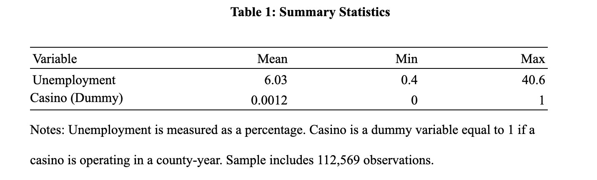

# Casino Openings and County Labor Markets: A Panel Data Analysis

---

## Overview

This repository contains the complete replication package for my senior econometrics research project at Michigan State University.

Using a county-level panel dataset of **112,569 observations (1990–2024)**, I evaluate whether casino openings improve local labor market outcomes using a Two-Way Fixed Effects panel regression model.

---

## Research Question

**Do casino openings improve local labor market outcomes by reducing county unemployment?**

---

## Key Findings

- **Dataset:** 112,569 county-year observations
- **Method:** Two-Way Fixed Effects (TWFE)
- **Estimated Effect:** +0.422 percentage points
- **Statistical Significance:** p < 0.01

Overall, the analysis finds a statistically significant positive association between casino operation and county unemployment after controlling for county and year fixed effects. These findings suggest that casino development alone should not be viewed as a guaranteed strategy for improving local labor market outcomes.
---

# Regression Results

  

---

## Methodology

The empirical analysis estimates the relationship between casino openings and county unemployment using:

- Two-Way Fixed Effects (TWFE) Panel Regression
- Ordinary Least Squares (OLS)
- County-clustered robust standard errors
- Panel data analysis
- Data cleaning and validation in Stata

---

# Summary Statistics

  

---

## Repository Structure

| File | Purpose |
|------|---------|
| `master.do` | Executes the complete analysis workflow |
| `01_prepare_data.do` | Cleans unemployment data |
| `02_prepare_lookup.do` | Creates county and state lookup tables |
| `03_merge_data.do` | Merges datasets into a panel |
| `04_prepare_casino.do` | Constructs casino treatment variables |
| `05_build_analysis.do` | Builds the final analysis dataset |
| `06_analysis.do` | Estimates econometric models and produces regression tables |

---

## Skills Demonstrated

- Applied Econometrics
- Panel Data Analysis
- Two-Way Fixed Effects (TWFE)
- Statistical Modeling
- Data Cleaning & Validation
- Stata Programming
- Research Design
- Policy Analysis
- Data Visualization
- Reproducible Research

---

## Software

- Stata
- Microsoft Excel

---

## Replication

This repository contains the complete Stata workflow used throughout the analysis.

The raw datasets are **not redistributed** because they originate from publicly available external sources. The project can be replicated by obtaining the original data from:

- U.S. Bureau of Labor Statistics (Local Area Unemployment Statistics)
- Public casino opening records

---

## Research Paper

The complete research paper is included in this repository.

📄 **Casino_Openings_and_County_Labor_Markets.pdf**

---

## About

Created by **Faisal Mulla**, an Economics student at Michigan State University with research interests in:

- Applied Econometrics
- Labor Economics
- Economic Development
- Energy Economics
- Public Policy
